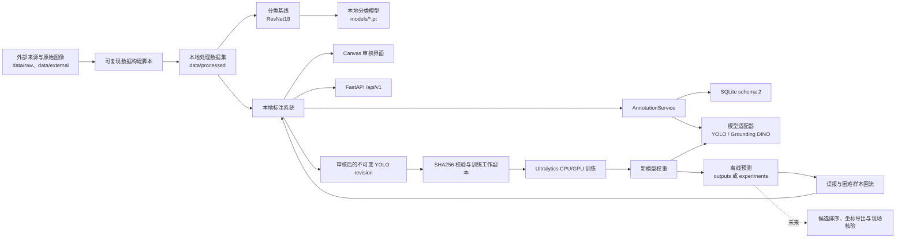
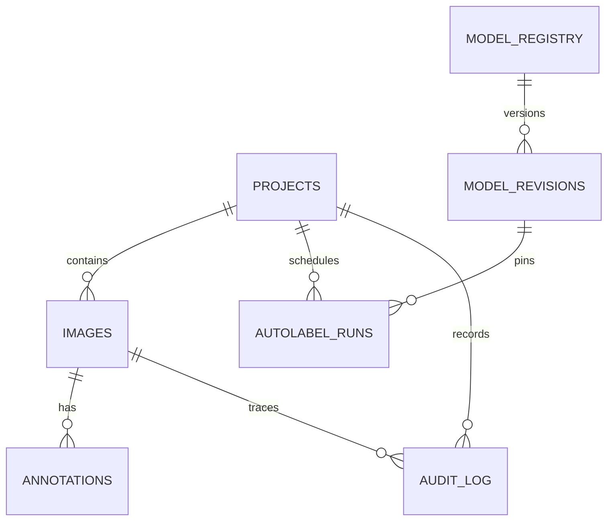

# RKHunter 工程架构

本文描述 RKHunter 当前实现的系统边界、组件分层、数据与模型生命周期、持久化设计、安全约束、测试策略和后续演进方向。

相关操作文档：

- [标注工具](annotation-tool.md)
- [工程工作流](workflow.md)
- [Windows 环境](environment-setup.md)
- [数据指南](data-guide.md)
- [YOLO 工程烟雾测试](yolo-smoke-test.md)

## 1. 系统定位

RKHunter 当前处于“数据集与可行性验证”阶段，目标是从荒漠、戈壁、干涸湖床等航拍图像中筛选疑似陨石候选，供人工复核和后续实地确认。

系统只识别视觉候选，不负责证明物体是陨石。候选坐标提取、航线规划、航拍瓦片拼接、无人机接入和现场验证仍属于未来阶段；`src/rkhunter/detect.py` 目前只是预留入口。

当前实现包含两条模型路径：

- 图像分类基线：验证小型本地训练与预测是否可行。
- YOLO 检测与标注闭环：当前主要工程链路，包括弱标签导入、自动提框、复核、不可变导出、训练、预测和模型升级。

## 2. 总体数据流



## 3. 仓库分层

| 层 | 路径 | 职责 |
|---|---|---|
| 数据源 | `data/raw/`、`data/external/` | 原始图片、来源清单、权威元数据和外部导出 |
| 数据构建 | `scripts/build_visual_baseline_classification_dataset.ps1`、`scripts/build_yolo_smoke_dataset.py` | 构建分类数据和可追踪来源的 YOLO 弱标签数据 |
| 分类基线 | `scripts/train_classifier.py`、`scripts/predict_classifier.py` | 使用 ResNet18 验证图像分类链路 |
| 标注前端 | `src/rkhunter/annotator/static/` | 原生 HTML/CSS/JavaScript Canvas；绘制、移动、缩放、分类、审核和导出 |
| API | `src/rkhunter/annotator/api.py` | FastAPI `/api/v1`；项目、图像、标注、模型、任务、统计、审计和导出接口 |
| 领域服务 | `src/rkhunter/annotator/service.py` | 路径与标签校验、YOLO 导入、并发控制、模型版本、自动标注、批任务和不可变导出 |
| 持久化 | `src/rkhunter/annotator/database.py` | SQLite、事务迁移、WAL、外键和 schema 完整性检查 |
| 模型适配 | `src/rkhunter/annotator/adapters/` | 统一自动标注协议；内置 Ultralytics YOLO 和可选 Grounding DINO |
| 检测训练/预测 | `scripts/train_yolo.py`、`scripts/predict_yolo.py` | 导出完整性验证、训练工作副本、显式本地模型和离线预测 |
| 链路验证 | `scripts/validate_annotation_pipeline.py` | 隔离数据库中执行导入、真实推理、审核、导出和 Ultralytics 回读 |
| 配置 | `configs/dataset.yaml`、`configs/model.yaml` | 类别、数据目录、图像尺寸和高召回目标 |
| 测试 | `tests/test_annotation_tool.py`、`tests/test_yolo_scripts.py` | 数据库、并发、模型溯源、导出、API 和路径安全测试 |

本地大文件边界：

```text
data/raw/       原始数据
data/external/  外部数据与元数据
data/processed/ 处理数据集
models/         权重和框架缓存
experiments/    标注数据库、导出和训练实验
outputs/        预测结果和报告
.venv/          Python 虚拟环境
```

这些目录由 `.gitignore` 排除。Git 只保存代码、配置、文档和轻量清单。

## 4. 标注子系统

```text
浏览器 Canvas
    ↓ JSON / HTTP
FastAPI /api/v1
    ↓
AnnotationService
    ├── SQLite 数据库
    ├── 本地图像与 YOLO 标签
    ├── 模型适配器注册表
    └── 不可变导出目录
```

前端没有 Node 构建依赖，静态文件随 Python 包发布。请求结构由 FastAPI/Pydantic 校验，关键业务约束集中在 `AnnotationService`，不会只依赖浏览器校验。

主要 API 资源：

- `health`：工具、数据库和 schema 状态。
- `projects`：项目注册和 YOLO 导入。
- `images`：分页队列、图像内容和单图详情。
- `annotations`：带乐观 revision 的标注保存。
- `models` / `model revisions`：模型别名与不可变历史版本。
- `autolabel-runs`：持久化批量任务、恢复和取消。
- `stats` / `events`：状态统计和审计事件。
- `exports/yolo`：仅审核内容的 YOLO revision 导出。

服务启动入口是 `scripts/run_annotation_tool.py`。它负责：

1. 限制服务只绑定回环地址；
2. 获取数据库操作系统文件锁；
3. 设置仓库内缓存和离线环境变量；
4. 注册或复用项目与本地模型；
5. 启动 Uvicorn 和批任务恢复流程。

## 5. 数据与状态模型

SQLite 当前 schema 为 `2`，主要表关系如下：



主要表：

| 表 | 作用 |
|---|---|
| `schema_meta` | 当前数据库 schema 版本 |
| `projects` | 数据集根目录、图像/标签目录和固定类别表 |
| `images` | 相对路径、split、尺寸、SHA256、状态和乐观 revision |
| `annotations` | 像素框、类别、来源、置信度、审核状态和模型溯源 |
| `model_registry` | 可变模型别名及当前 revision 指针 |
| `model_revisions` | 不可变模型内容、配置、版本和 SHA256 |
| `autolabel_runs` | 固定模型 revision 的持久化批任务及进度 |
| `audit_log` | 项目、图像、模型、导出和恢复操作历史 |

图像状态：

- `unreviewed`：没有可用标签或尚未处理。
- `auto_labeled`：存在模型或导入产生的草稿。
- `reviewed`：审核通过；可以有批准框，也可以是空背景。
- `rejected`：整张图不纳入训练，必须为空标注。

标注状态：

- `draft`：模型或尚未批准的导入框。
- `approved`：随 `reviewed` 图像保存的框。

内部标准坐标为像素 `xyxy`。导入和导出边界负责与 YOLO 归一化中心坐标转换。

`background` 不是检测框。纯背景必须表示为 `reviewed` 图像、空标注列表和空 `.txt` 文件。导出时 `background` 会从检测类别中移除，并重新映射其余类别 ID。

## 6. 标注与模型升级生命周期

1. 注册本地 YOLO 数据集并计算源图像、源标签 SHA256。
2. 导入标签；弱标签进入 `auto_labeled/draft`。
3. 注册显式本地模型，建立模型别名和不可变 revision。
4. 对单图或队列运行自动标注；模型结果始终是草稿。
5. 审核者调整框，并批准、确认纯背景或拒绝图像。
6. 只导出 `reviewed` 图像和 `approved` 框。
7. 校验 manifest，复制到训练工作目录后运行 Ultralytics。
8. 将新权重注册为新 revision 或独立实验别名。
9. 保留旧 revision 与旧标注溯源，将误报和困难样本回流到下一轮审核。

模型 revision 指纹包含：

- 模型别名和适配器名称；
- 权重文件或目录的内容 SHA256；
- 解析后的本地路径；
- 规范化适配器配置；
- RKHunter 工具版本；
- 适配器实现版本。

权重内容若被原地修改，推理会被拒绝，必须注册新 revision。历史标注继续指向原 revision，不会被别名升级改写。

内置适配器：

- `ultralytics_yolo`：接收显式本地 `.pt` 文件，当前已实际验证。
- `grounding_dino`：可选适配器，只接受预先下载的本地 Transformers 模型目录，并使用 `local_files_only=True`。

第三方适配器可以通过 `rkhunter.annotator_adapters` Python entry-point 扩展，并应维护独立的 `adapter_version`。

## 7. 不可变 YOLO 导出

导出先写入隐藏 staging 目录，所有步骤成功后再原子重命名。失败时删除 staging，不发布半成品。

每个 revision：

```text
<revision>/
  dataset.yaml
  manifest.json
  images/train|val|test/
  labels/train|val|test/
```

`manifest.json` 记录：

- 工具和标注 schema 版本；
- 类别映射；
- 各 split 的图像与框数量；
- 每个图像、标签和 `dataset.yaml` 的 SHA256；
- 来源图像 revision；
- `train_ready` 及结构性问题代码。

训练就绪最低条件是 `train`、`val` 均有审核图像和至少一个批准目标框。该条件只证明结构可训练，不代表样本量、分布或模型质量足够。

`scripts/train_yolo.py` 会先验证全部 canonical hash，再把数据复制到 `experiments/yolo/_dataset_work/`。Ultralytics 的 `*.cache` 只写入工作副本，不会修改已发布的 export revision。

## 8. 训练与预测

### 分类基线

`train_classifier.py` 使用 torchvision ResNet18，在 `visual-baseline-001` 的类别文件夹上训练。它是早期工程验证分支，不产生定位框，也不应被当作真实航拍检测器。

分类脚本仍使用 `ResNet18_Weights.DEFAULT`。若权重不在 torchvision 缓存中，框架可能尝试下载；该旧链路尚未达到 YOLO 链路相同的严格离线边界。

### YOLO 检测

`train_yolo.py`：

- 只接受仓库内已存在的显式本地模型；
- 验证审核导出的 manifest 和全部文件哈希；
- 拒绝结构上未就绪的数据版本；
- 在忽略目录中创建独立训练工作副本；
- 支持 CPU 或显式设备参数。

`predict_yolo.py`：

- 只接受仓库内本地权重和本地文件/目录输入；
- 拒绝 `.streams`、`.txt`、`.csv` 间接输入，避免网络流或仓库外引用；
- 校验输出目录和运行名，阻止路径逃逸及 Windows 保留名称；
- 默认使用 CPU，预测结果写入忽略目录。

## 9. 并发、恢复与审计

- 启动器对数据库持有操作系统文件锁，同一数据库只允许一个标注服务进程。
- SQLite 使用 WAL、外键和 busy timeout。
- schema 迁移使用 `BEGIN IMMEDIATE`，并拒绝高于程序支持版本的数据库。
- 服务进程内部使用写锁串行化关键写操作。
- 图像保存采用乐观 revision；旧客户端提交返回 HTTP `409`。
- 模型推理完成后再次比较图像 revision，避免推理期间的人工修改被覆盖。
- 批任务固定使用创建时的 model revision，逐图保存进度和错误。
- 服务重启后，处于 `running` 的任务重新进入 `queued` 并恢复。
- 导入、保存、模型升级、批任务恢复和导出都会写入审计日志。

## 10. 本地与离线安全边界

YOLO 标注、训练和预测链路具备以下边界：

- 服务只能绑定 `127.0.0.1`、`localhost` 或 `::1`。
- FastAPI Trusted Host 只接受回环访问。
- 数据库、数据集、模型、缓存、导出和预测路径必须解析在仓库内。
- 检查目录穿越和指向仓库外部的符号链接或 junction。
- 强制设置 `YOLO_OFFLINE=true` 和 `YOLO_AUTOINSTALL=false`。
- 模型必须是已存在的本地路径，不接受可能触发下载的名称。
- Ultralytics、Matplotlib 和 Torch 缓存放在仓库内忽略目录。
- 自动标注不能覆盖 `reviewed`、`rejected` 或已有批准框的图像。
- 导出使用复制、内容哈希、隐藏 staging 和原子发布。
- 数据、模型、数据库、缓存和实验结果由 `.gitignore` 排除。

该服务是单机、单用户、本地优先工具，不提供远程部署所需的认证、TLS、多用户权限或分布式任务队列。若未来开放远程访问，必须在现有服务前增加独立的认证、授权、网络隔离和备份方案。

## 11. 运行与部署拓扑

当前验证环境：

```text
Windows
Python 3.12.10
虚拟环境 D:\RKHunter\.venv
PyTorch CPU 版
Ultralytics 8.4.92
FastAPI + Uvicorn
SQLite 本地数据库
```

默认拓扑：

```text
本机浏览器
    ↓ http://127.0.0.1:8765
单个 Python/Uvicorn 进程
    ├── FastAPI + 静态 Canvas 前端
    ├── 单工作线程自动标注队列
    ├── SQLite 数据库
    ├── 本地图像/标签
    └── CPU 本地模型
```

启动命令：

```powershell
D:\RKHunter\.venv\Scripts\python.exe scripts\run_annotation_tool.py `
  --dataset data\processed\rkhunter `
  --model <仓库内本地权重>
```

默认数据库是 `experiments/annotation-tool/annotator-v1.db`。文件名保留 `v1` 是兼容性原因，实际 schema 为 `2`。

Python 包使用 `src/` 布局，版本由 `src/rkhunter/__init__.py` 单一提供，静态前端作为 `rkhunter.annotator` package data 进入 wheel。当前工具版本为 `0.2.0`。

## 12. 测试策略

自动测试覆盖：

- YOLO 像素坐标往返和背景语义；
- 乐观并发冲突与审计事务；
- 审核结果不可被模型覆盖；
- 推理期间并发编辑检测；
- 权重原地变化检测；
- 模型别名升级和不可变溯源；
- 批任务恢复、取消和错误保留；
- 源图片/标签变化检测；
- 路径、符号链接和类别边界；
- 不可变导出、碰撞处理和失败清理；
- export hash 与 `train_ready` 规则；
- schema 迁移、未来 schema 拒绝和迁移竞争；
- FastAPI 版本与 HTTP `409`；
- 训练和预测脚本的仓库路径及运行名约束。

`scripts/validate_annotation_pipeline.py` 另外使用真实本地模型，在隔离数据库中执行导入、推理、审核、导出和 Ultralytics 回读，并确认源数据的大小和修改时间没有变化。

标准验证命令：

```powershell
D:\RKHunter\.venv\Scripts\python.exe -m unittest discover -s tests -v
D:\RKHunter\.venv\Scripts\python.exe scripts\validate_annotation_pipeline.py
```

## 13. 当前验证检查点

截至 2026-07-12，本地链路已验证：

- 150 张弱标签参考/干扰图成功导入；
- SQLite schema 2 的迁移、完整性、并发和模型溯源正常；
- 17 张图处于审核状态，共 13 个批准框；
- 审核导出包含 `train=9`、`val=7`、`test=1`，结构上可训练；
- 五个 epoch 的 CPU 微调和本地预测成功；
- 新权重可以作为独立实验模型 revision 注册；
- 定性预测仍有普通岩石误报、重复框和过宽框，因此未批量覆盖其余草稿。

该检查点证明工程闭环可运行，不证明模型具备真实航拍发现陨石的能力。

## 14. 当前限制

- 当前数据主要是参考图、宽泛弱框和少量代理辅助复核，不是可靠人工真值。
- 小型验证集上的高指标不能外推到真实航拍环境。
- 缺少足量俯视自然地面正样本、困难负样本和独立任务式留出集。
- 尚未实现地理坐标、航拍瓦片拼接、候选排序和无人机任务接口。
- 当前只适合单机单服务，没有远程认证和多人协同。
- Grounding DINO 需要预先下载完整本地模型目录，尚未作为默认运行链路。
- Ultralytics 安装报告为 AGPL-3.0，闭源或商业分发前需要许可证评估。
- 所有视觉候选仍必须经过人工现场和必要的实验室确认。

## 15. 演进方向

建议按以下顺序继续：

1. 增加俯视自然地面上的疑似陨石和困难负样本，并完成真实人工框审核。
2. 建立按采集地点或任务分组的独立 train/val/test，避免近重复泄漏。
3. 通过误报回流持续改进候选检测和置信度标定。
4. 增加航拍瓦片、图像姿态和地理参考元数据模型。
5. 实现像素框到地图坐标的转换、候选合并与排序。
6. 在手机或录制视频上完成任务模拟，再评估无人机硬件接入。
7. 若需要多人或远程使用，再拆分对象存储、数据库、任务队列、认证和部署边界。
